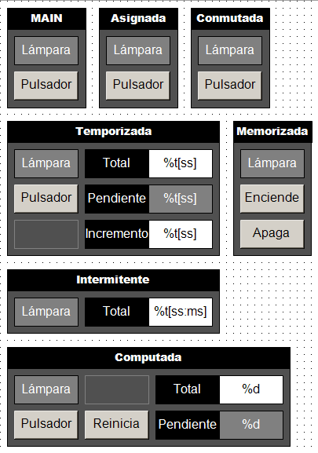
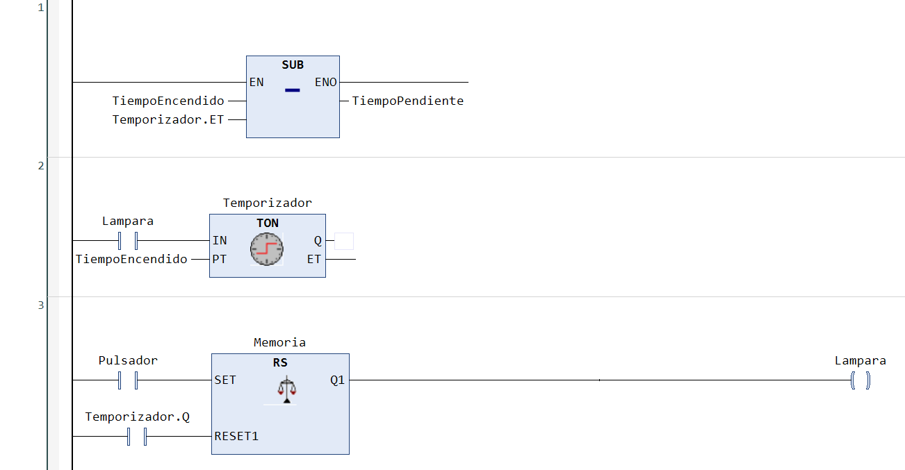
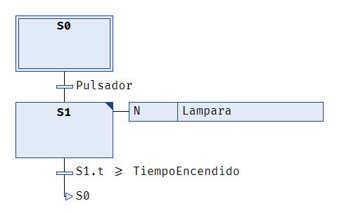

# # 💡 Lampara (TwinCAT 3)

## 📝 Descripción del Proyecto

El proyecto `Lampara` es un proyecto básico, que pretende mostrar el uso de los **bloques funcionales (FB)** principales de la **librería estándar** (Tc2_standar.lib) en los diferentes lenguajes (IL, LD, ST, SFC) de la norma IEC 61131-3. Para lo que se programan en diferentes bloques funcionales diferentes modalidades de lámparas.

### 🔢 Modalidades

1. **Lámpara Asignada**. La lámpara "copia" el estado del pulsador (operador de asignación).
1. **Lámpara Memorizada**. Un pulsador enciende la lampara y otro la apaga (control de flujo de ejecución del programa).
1. **Lámpara Conmutada**. El mismo pulsador enciende y apaga la lámpara (detección de flancos → R_TRIG).
1. **Lámpara Temporizada**. La lámpara se apaga transcurrido un cierto tiempo después de accionar el pulsador (temporizador de retardo a la conexión → TON).
1. **Lámpara Computada**. La lámpara se enciende tras accionar varias veces el pulsador y se apaga al accionar el pulsador de reinicio (contador de decremento → CTD).
1. **Lámpara Intermitente**. La lámpara parpadea (temporizador auto-pilotado).

<p align="center">
  
</p>

Este proyecto dispone de una  **visualización** elemental que permite interactuar con las variables del proyecto para facilitar la prueba.

### 💻 Código

A continuación se muestra, a modo de ejemplo, el código correspondiente a la lámpara temporizada en los diferentes lenguajes de programación.

- Implementación en IL

```C
FUNCTION_BLOCK FB_LamparaTemporizada_IL
// La lampara se enciende al accionar el pulsador
// La lampara se apaga transcurrido un tiempo encendidaVAR_INPUT
VAR
    TiempoEncendido   : TIME := T#2S;
END_VAR
VAR_OUTPUT
    TiempoPendiente   : TIME;
END_VAR
VAR
    Temporizador      : TON;
    Lampara   AT %Q*  : BOOL;
    Pulsador  AT %I*  : BOOL;
END_VAR

1
    CAL Temporizador(
      IN  := Lampara,
      PT  := TiempoEncendido
    )

2
    LD  TiempoEncendido
    SUB Temporizador.ET
    ST  TiempoPendiente

3
    LD  Pulsador
    S   Lampara

4
    LD  Temporizador.Q
    R   Lampara
```

- Implementación en LD

```C
FUNCTION_BLOCK FB_LamparaTemporizada_LD
// La lampara se enciende al accionar el pulsador
// La lampara se apaga transcurrido un tiempo encendida
VAR_INPUT
    TiempoEncendido   : TIME := T#2S;
END_VAR
VAR_OUTPUT
    TiempoPendiente   : TIME;
END_VAR
VAR
    Temporizador      : TON;
    Memoria           : RS;
    Lampara   AT %Q*  : BOOL;
    Pulsador  AT %I*  : BOOL;
END_VAR
```



- Implementación en SFC

```C
FUNCTION_BLOCK FB_LamparaTemporizada_SFC
// La lampara se enciende al accionar el pulsador
// La lampara se apaga transcurrido un tiempo encendida
VAR_INPUT
    TiempoEncendido   : TIME := T#2S;
END_VAR
VAR_OUTPUT
    TiempoPendiente   : TIME;
END_VAR
VAR
    Lampara   AT %Q*  : BOOL;
    Pulsador  AT %I*  : BOOL;
END_VAR
```



- Implementación en ST

```C
FUNCTION_BLOCK FB_LamparaTemporizada_ST
// La lampara se enciende al accionar el pulsador
// La lampara se apaga transcurrido un tiempo encendida
VAR_INPUT
    TiempoEncendido   : TIME := T#2S;
END_VAR
VAR_OUTPUT
    TiempoPendiente   : TIME;
END_VAR
VAR
    Temporizador      : TON;
    
    Lampara   AT %Q*  : BOOL;
    Pulsador  AT %I*  : BOOL;
END_VAR

Temporizador(
    IN := Lampara, 
    PT := TiempoEncendido
    );

IF Pulsador THEN
    Lampara := TRUE;
ELSIF Temporizador.Q THEN
    Lampara := FALSE;
END_IF;

TiempoPendiente := TiempoEncendido - Temporizador.ET;
```

---

## 💻 Requisitos del Sistema

### Software

- **IDE:** Microsoft Visual Studio / TwinCAT 3 XAE (Versión mínima recomendada: **3.1.4024.x**).
- **Lenguajes:** Texto Estructurado (ST) y Diagrama de Funciones Secuenciales (SFC).

---

## 🚀 Puesta en Marcha

Para descargar, compilar y ejecutar este proyecto en el entorno de TwinCAT 3, sigua los siguientes pasos:

1. **Clonar Repositorio:**

```bash
    git clone https://github.com/vetorres-uma/TC3_Lámpara.git
```

2. **Abrir el Proyecto:** abra el archivo `.sln` (Solución) ubicado en la carpeta principal utilizando el entorno de ingeniería **TwinCAT XAE** (integrado en Visual Studio).
1. **Selección del Controlador:** seleccione el simulador (**UmRT_Default**) o controlador local o remoto (**Choose Runtime System**).
1. **Activación de Configuración:** en el modo **Configuración**, active la configuración (**Activate Configuration**) y reinicie TwinCAT en modo **Ejecución (Run Mode)**.
1. **Carga del Código:** en el entorno PLC, inicie la sesión y descargue el programa al PLC (**Login**).
1. **Poner el código en ejecución:** ejecute la lógica de control en el controlador (**Start**). Puede utilizar la visualización integrada en el proyecto PLC para facilitar la prueba.

---

## 🤝 Contribuciones

Este proyecto es utilizado con fines educativos y de prueba. Las contribuciones, sugerencias o correcciones de errores son bienvenidas. Por favor, abra un *Issue* o envíe un *Pull Request* si deseas contribuir.

---

## 🧑‍💻 Autor

- **Autor Principal:** Victor Torres (@vetorres-uma)

---

## ⚖️ Licencia

Este proyecto es de código abierto y está disponible bajo la **Licencia Pública General GNU (GPL)**.

- Consulte el archivo `LICENSE.md` para más detalles.
  